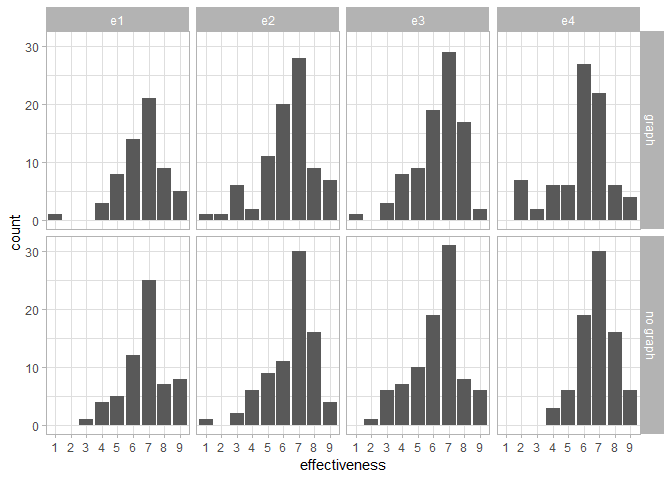
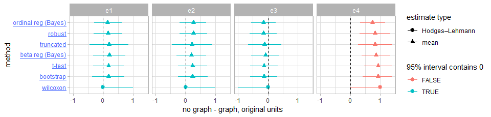
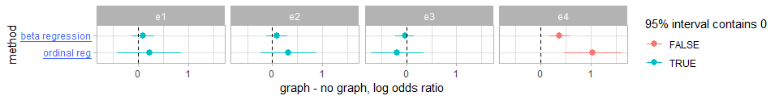
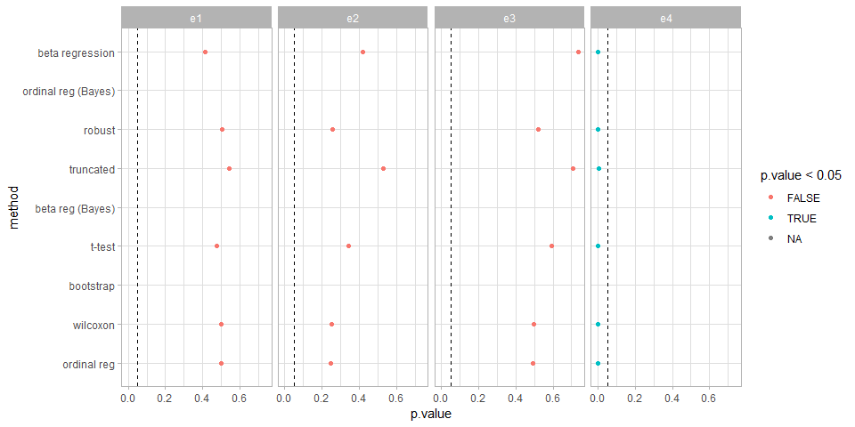
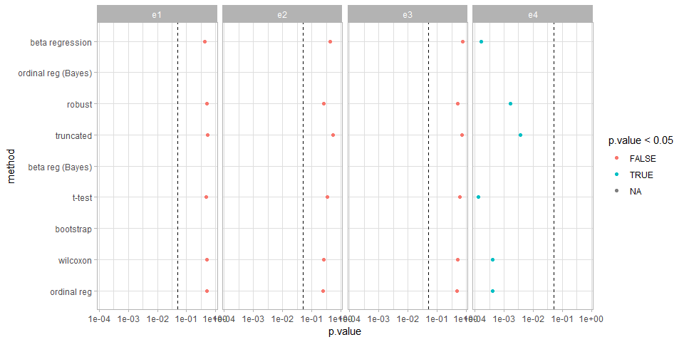

Likert data analyses
================

This document shows several different analyses of a single Likert-type
item. It is by no means exhaustive.

If you want to skip the details, there is a [summary of the
results](#summary-of-results) at the bottom of the document.

## Setup

``` r
library(gamlss)
library(gamlss.tr)
library(simpleboot)
library(tidyverse)
library(broom)
library(ggstance)
library(tidybayes)
library(ordinal)
library(betareg)
library(brms)
library(rstanarm)
library(rstan)
library(emmeans)
library(modelr)
library(forcats)

options(mc.cores = parallel::detectCores())
rstan_options(auto_write = TRUE)
theme_set(theme_light())
```

## Data

Read in likert-type data from the “blinded with science” study. The
study has 4 experiments. In each experiment, each participant is either
shown a text about a hypothetical drug (“no graph” condition) or the
same text with a chart (“graph” condition). The participant is then
asked to assess to what extent the drug is effective, on a scale from 1
to 7. We focus on this data here. The study has another dependent
variable that’s more important (error of the response to a comprehension
question) but it’s not Likert-type data.

Let’s read in the data:

``` r
blinded <- read_csv("blinded.csv",
  col_types = cols(
    experiment = col_integer(),
    condition = col_character(),
    effectiveness = col_integer()
  )) %>%
  mutate(
    experiment = paste0("e", experiment),
    condition = fct_recode(condition, `no graph` = "no_graph")
  )
head(blinded)
```

<div class="kable-table">

| experiment | condition | effectiveness |
| :--------- | :-------- | ------------: |
| e1         | no graph  |             7 |
| e1         | graph     |             6 |
| e1         | no graph  |             9 |
| e1         | no graph  |             4 |
| e1         | graph     |             6 |
| e1         | no graph  |             7 |

</div>

It looks like this:

``` r
blinded %>%
  ggplot(aes(x = ordered(effectiveness))) +
  stat_count() +
  facet_grid(rows = vars(condition), cols = vars(experiment)) +
  xlab("effectiveness")
```

<!-- -->

## Analyses

### Bootstrap CI

For each experiment, compute the difference between the two means and
its 95% bootstrap CI.

First, we’ll create a helper function to compute bootstrap CIs in a tidy
way (with `broom`-compatible
output):

``` r
tidy_bootstrap_mean_diff <- function(group1, group2, conf.level = 0.95, R = 1000, seed = 98432098) {
  set.seed(seed) # make deterministic
  bootstrap_samples <- two.boot(sample1 = group1, sample2 = group2, FUN = function(x, d) mean(x[d]), R = R)
  bootci <- boot.ci(bootstrap_samples, type = "bca", conf = conf.level)
  data.frame(
    estimate = mean(group1) - mean(group2),
    conf.low = bootci$bca[4],
    conf.high = bootci$bca[5]
  )
}
```

Now we’ll apply that function within each experiment:

``` r
result_boot = blinded %>%
  group_by(experiment) %>%
  do(tidy_bootstrap_mean_diff(
    filter(., condition == "no graph")$effectiveness,
    filter(., condition == "graph")$effectiveness
  )) %>%
  mutate(
    method = "bootstrap",
    estimate_type = "mean"
  )

result_boot
```

<div class="kable-table">

| experiment |    estimate |    conf.low | conf.high | method    | estimate\_type |
| :--------- | ----------: | ----------: | --------: | :-------- | :------------- |
| e1         |   0.1842940 | \-0.3678110 | 0.7083115 | bootstrap | mean           |
| e2         |   0.2375279 | \-0.2477667 | 0.7425197 | bootstrap | mean           |
| e3         | \-0.1250000 | \-0.5962644 | 0.3140045 | bootstrap | mean           |
| e4         |   0.9250000 |   0.4250000 | 1.3875000 | bootstrap | mean           |

</div>

### t-test

For each experiment, compute the difference between the two means, its
95% t-based CI and the p-value.

We’ll use the `broom::tidy` function, which cleans up test and model
outputs into a common tidy format:

``` r
result_t = blinded %>%
  group_by(experiment) %>%
  do(tidy(t.test(effectiveness ~ fct_rev(condition), data = .))) %>%
  mutate(
    method = "t-test",
    estimate_type = "mean"
  )

result_t
```

<div class="kable-table">

| experiment |    estimate | estimate1 | estimate2 |   statistic |   p.value | parameter |    conf.low | conf.high | method | alternative | estimate\_type |
| :--------- | ----------: | --------: | --------: | ----------: | --------: | --------: | ----------: | --------: | :----- | :---------- | :------------- |
| e1         |   0.1842940 |  6.758064 |  6.573771 |   0.7160629 | 0.4753364 |  120.6314 | \-0.3252560 | 0.6938441 | t-test | two.sided   | mean           |
| e2         |   0.2375279 |  6.531646 |  6.294118 |   0.9498784 | 0.3435891 |  161.9850 | \-0.2562726 | 0.7313285 | t-test | two.sided   | mean           |
| e3         | \-0.1250000 |  6.215909 |  6.340909 | \-0.5345334 | 0.5936570 |  173.4708 | \-0.5865553 | 0.3365553 | t-test | two.sided   | mean           |
| e4         |   0.9250000 |  6.850000 |  5.925000 |   3.9320715 | 0.0001328 |  137.9469 |   0.4598477 | 1.3901523 | t-test | two.sided   | mean           |

</div>

### Wilcoxon

Compute the Wilcoxon signed-rank test and p-value. The `estimate` (and
95% CIs) in this are for the median of the difference between samples
(*not* the difference in the medians).

``` r
result_wilcoxon = blinded %>%
  group_by(experiment) %>%
  do(tidy(wilcox.test(effectiveness ~ fct_rev(condition), data = ., conf.int = TRUE, exact = FALSE, correct = FALSE))) %>%
  mutate(
    method = "wilcoxon",
    estimate_type = "Hodges–Lehmann"
  )

result_wilcoxon
```

<div class="kable-table">

| experiment |    estimate | statistic |   p.value |    conf.low | conf.high | method   | alternative | estimate\_type |
| :--------- | ----------: | --------: | --------: | ----------: | --------: | :------- | :---------- | :------------- |
| e1         |   0.0000392 |    2020.0 | 0.4994453 | \-0.0000255 | 0.9999686 | wilcoxon | two.sided   | Hodges–Lehmann |
| e2         |   0.0000058 |    3697.0 | 0.2499520 | \-0.0000405 | 0.9999722 | wilcoxon | two.sided   | Hodges–Lehmann |
| e3         | \-0.0000206 |    3648.0 | 0.4954543 | \-0.9999611 | 0.0000035 | wilcoxon | two.sided   | Hodges–Lehmann |
| e4         |   0.9999774 |    4205.5 | 0.0003968 |   0.0000513 | 1.0000109 | wilcoxon | two.sided   | Hodges–Lehmann |

</div>

### Beta regression

For an argument for the use of Beta regression on data like this (in a
frequentist mode), see
[here](https://www.ncbi.nlm.nih.gov/pubmed/16594767). There are two
tricky bits: (1) the data needs to be rescaled to be in \((0,1)\); in
the case of a Likert item response in \([1,k]\) a natural approach might
be to divide the values by \(k + 1\), in this case, 10. (2) Getting
estimates of mean differeneces on the original scale is a pain—for the
frequentist version I won’t do this, but for the Bayesian version I will
(because I actually know how to do that).

First, we’ll fit a beta regression within each experiment, using default
priors:

``` r
models_beta_freq = blinded %>%
  group_by(experiment) %>%
  do(model = betareg(I(effectiveness/10) ~ condition, data = .))
```

Then we’ll get an estimate for the log odds ratio between conditions:

``` r
result_beta_freq = models_beta_freq %>% 
  mutate(fits = list(tidy(model, conf.int = TRUE))) %>%
  unnest(fits) %>%
  filter(term == "conditionno graph", component == "mean") %>%
  mutate(
    method = "beta regression",
    estimate_type = "log odds ratio"
  )

result_beta_freq
```

<div class="kable-table">

| experiment | component | term              |    estimate | std.error |   statistic |   p.value |    conf.low | conf.high | method          | estimate\_type |
| :--------- | :-------- | :---------------- | ----------: | --------: | ----------: | --------: | ----------: | --------: | :-------------- | :------------- |
| e1         | mean      | conditionno graph |   0.0938033 | 0.1148526 |   0.8167279 | 0.4140840 | \-0.1313037 | 0.3189104 | beta regression | log odds ratio |
| e2         | mean      | conditionno graph |   0.0858581 | 0.1062866 |   0.8077980 | 0.4192069 | \-0.1224598 | 0.2941760 | beta regression | log odds ratio |
| e3         | mean      | conditionno graph | \-0.0331576 | 0.0974875 | \-0.3401215 | 0.7337650 | \-0.2242297 | 0.1579144 | beta regression | log odds ratio |
| e4         | mean      | conditionno graph |   0.3792764 | 0.1008401 |   3.7611663 | 0.0001691 |   0.1816334 | 0.5769194 | beta regression | log odds ratio |

</div>

### Bayesian Beta regression

This is a Bayesian formulation of Beta regression. I show the Bayesian
approach here because it makes it easier to generate marginal means on
the original scale (and intervals on them).

First, we’ll fit a beta regression within each experiment, using default
priors:

``` r
set.seed(31818) # for reproducibility
models_beta = blinded %>%
  nest(-experiment) %>%
  mutate(model = map(data, ~ stan_betareg(I(effectiveness/10) ~ condition, data = .)))
```

Then we’ll get an estimate for the predicted marginal means in each
condition, and then find the posterior distribution for the difference
in those means:

``` r
result_beta = models_beta %>% 
  mutate(draws = map(model, fitted_draws, data_grid(blinded, condition))) %>%
  unnest(draws) %>%
  # .value contains draws from marginal means on 0-1 scale,
  # transform back to original scale
  mutate(.value = .value * 10) %>%
  group_by(experiment) %>%
  # get draws from distribution of difference in marginal means
  compare_levels(.value, by = condition) %>%
  median_qi(.value) %>%
  to_broom_names() %>%
  mutate(
    method = "beta reg (Bayes)",
    estimate_type = "mean"
  )

result_beta
```

<div class="kable-table">

| experiment | condition        |    estimate |    conf.low | conf.high | .width | .point | .interval | method           | estimate\_type |
| :--------- | :--------------- | ----------: | ----------: | --------: | -----: | :----- | :-------- | :--------------- | :------------- |
| e1         | no graph - graph |   0.2068054 | \-0.3386470 | 0.7439835 |   0.95 | median | qi        | beta reg (Bayes) | mean           |
| e2         | no graph - graph |   0.1969086 | \-0.3028945 | 0.6892134 |   0.95 | median | qi        | beta reg (Bayes) | mean           |
| e3         | no graph - graph | \-0.0780379 | \-0.5545330 | 0.3892573 |   0.95 | median | qi        | beta reg (Bayes) | mean           |
| e4         | no graph - graph |   0.8675340 |   0.3785523 | 1.3324362 |   0.95 | median | qi        | beta reg (Bayes) | mean           |

</div>

### Ordinal logistic regression

Another model often applied to Likert-type data is ordinal models.
Ordinal models come in plenty of flavors; we’ll use a cumulative link
logisitic regression model (also often called ordinal logisitic
regression), which is a common variety.

``` r
models_ord_freq = blinded %>%
  nest(-experiment) %>%
  mutate(model = map(data, ~ clm(ordered(effectiveness, levels = as.character(1:9)) ~ condition, data = .)))
```

Then we’ll get an estimate for the log odds ratio between conditions:

``` r
result_ord_freq = models_ord_freq %>% 
  mutate(fit = map(model, ~ tidy(pairs(emmeans(., ~ condition), reverse = TRUE), infer = TRUE))) %>%
  unnest(fit) %>%
  rename(
    conf.low = asymp.LCL,
    conf.high = asymp.UCL
  ) %>%
  select(-data, -model) %>%
  mutate(
    method = "ordinal reg",
    estimate_type = "log odds ratio"
  )

result_ord_freq
```

<div class="kable-table">

| experiment | level1   | level2 |    estimate | std.error |  df |    conf.low | conf.high |     z.ratio |   p.value | method      | estimate\_type |
| :--------- | :------- | :----- | ----------: | --------: | --: | ----------: | --------: | ----------: | --------: | :---------- | :------------- |
| e1         | no graph | graph  |   0.2196451 | 0.3239103 | Inf | \-0.4152075 | 0.8544976 |   0.6781045 | 0.4977054 | ordinal reg | log odds ratio |
| e2         | no graph | graph  |   0.3239302 | 0.2803893 | Inf | \-0.2256227 | 0.8734831 |   1.1552873 | 0.2479728 | ordinal reg | log odds ratio |
| e3         | no graph | graph  | \-0.1839185 | 0.2689883 | Inf | \-0.7111257 | 0.3432888 | \-0.6837416 | 0.4941384 | ordinal reg | log odds ratio |
| e4         | no graph | graph  |   1.0401772 | 0.2938706 | Inf |   0.4642013 | 1.6161531 |   3.5395752 | 0.0004008 | ordinal reg | log odds ratio |

</div>

### Bayesian Ordinal logistic regression

We’ll do an ordinal logistic regression in a Bayesian manner because it
will make it easier to get estimates of marginal means on the original
scale afterwards:

``` r
set.seed(221818) # for reproducibility
models_ord = blinded %>%
  nest(-experiment) %>%
  mutate(model = map(data, ~ brm(
    effectiveness ~ condition, data = ., family = cumulative(link = "logit"),
    prior = c(prior(normal(0, 1), class = b), prior(normal(0, 5), class = Intercept)),
    control = list(adapt_delta = .99)
  )))
```

    ## Compiling the C++ model

    ## Start sampling

    ## Warning: There were 17 divergent transitions after warmup. Increasing adapt_delta above 0.99 may help. See
    ## http://mc-stan.org/misc/warnings.html#divergent-transitions-after-warmup

    ## Warning: Examine the pairs() plot to diagnose sampling problems

    ## Compiling the C++ model

    ## recompiling to avoid crashing R session

    ## Start sampling

    ## Compiling the C++ model

    ## recompiling to avoid crashing R session

    ## Start sampling

    ## Compiling the C++ model

    ## recompiling to avoid crashing R session

    ## Start sampling

Then pull out the estimates:

``` r
result_ord = models_ord %>%
  mutate(draws = map(model, fitted_draws, data_grid(blinded, condition), value = "P(effectiveness|condition)")) %>%
  unnest(draws) %>%
  # calculate marginal means
  group_by(experiment, condition, .draw) %>%
  mutate(effectiveness = as.numeric(as.character(.category))) %>%
  summarise(.value = sum(effectiveness * `P(effectiveness|condition)`)) %>%
  # distribution of difference in marginal means
  group_by(experiment) %>%
  compare_levels(.value, by = condition) %>%
  median_qi(.value) %>%
  to_broom_names() %>%
  mutate(
    method = "ordinal reg (Bayes)",
    estimate_type = "mean"
  )

result_ord
```

<div class="kable-table">

| experiment | condition        |    estimate |    conf.low | conf.high | .width | .point | .interval | method              | estimate\_type |
| :--------- | :--------------- | ----------: | ----------: | --------: | -----: | :----- | :-------- | :------------------ | :------------- |
| e1         | no graph - graph |   0.1493229 | \-0.2974109 | 0.6274117 |   0.95 | median | qi        | ordinal reg (Bayes) | mean           |
| e2         | no graph - graph |   0.2609498 | \-0.1929479 | 0.7012135 |   0.95 | median | qi        | ordinal reg (Bayes) | mean           |
| e3         | no graph - graph | \-0.1479609 | \-0.5556217 | 0.2641531 |   0.95 | median | qi        | ordinal reg (Bayes) | mean           |
| e4         | no graph - graph |   0.7433414 |   0.3269262 | 1.1717870 |   0.95 | median | qi        | ordinal reg (Bayes) | mean           |

</div>

### Robust regression

We’ll use a robust, heteroskedastic linear regression: a Student t error
distribution instead of Gaussian error distribution, and estimate a
different variance parameter for each group. This is essentially
Kruschke’s [BEST test](http://www.indiana.edu/~kruschke/BEST/BEST.pdf)
(a Bayesian, robust, hetereoskedastic alternative to the t-test), but
estimated using a frequentist procedure instead of a Bayesian one:

``` r
gamlss_fixed = function(..., data) {
  # gamlss has a bug where it does not work if `data` is not in the global environment (!!!!)
  temp_df <<- data
  gamlss(..., data = temp_df)
}

models_robust = blinded %>%
  group_by(experiment) %>%
  do(model = gamlss_fixed(effectiveness ~ condition, sigma.formula = ~ condition, family = "TF", data = .))
```

    ## GAMLSS-RS iteration 1: Global Deviance = 431.1339 
    ## GAMLSS-RS iteration 2: Global Deviance = 431.0836 
    ## GAMLSS-RS iteration 3: Global Deviance = 431.0688 
    ## GAMLSS-RS iteration 4: Global Deviance = 431.0642 
    ## GAMLSS-RS iteration 5: Global Deviance = 431.0627 
    ## GAMLSS-RS iteration 6: Global Deviance = 431.0623 
    ## GAMLSS-RS iteration 1: Global Deviance = 613.3834 
    ## GAMLSS-RS iteration 2: Global Deviance = 613.0218 
    ## GAMLSS-RS iteration 3: Global Deviance = 612.8633 
    ## GAMLSS-RS iteration 4: Global Deviance = 612.7906 
    ## GAMLSS-RS iteration 5: Global Deviance = 612.7573 
    ## GAMLSS-RS iteration 6: Global Deviance = 612.7422 
    ## GAMLSS-RS iteration 7: Global Deviance = 612.7352 
    ## GAMLSS-RS iteration 8: Global Deviance = 612.7321 
    ## GAMLSS-RS iteration 9: Global Deviance = 612.7307 
    ## GAMLSS-RS iteration 10: Global Deviance = 612.7301 
    ## GAMLSS-RS iteration 1: Global Deviance = 650.9131 
    ## GAMLSS-RS iteration 2: Global Deviance = 650.8548 
    ## GAMLSS-RS iteration 3: Global Deviance = 650.834 
    ## GAMLSS-RS iteration 4: Global Deviance = 650.8244 
    ## GAMLSS-RS iteration 5: Global Deviance = 650.82 
    ## GAMLSS-RS iteration 6: Global Deviance = 650.818 
    ## GAMLSS-RS iteration 7: Global Deviance = 650.8171 
    ## GAMLSS-RS iteration 1: Global Deviance = 566.1012 
    ## GAMLSS-RS iteration 2: Global Deviance = 566.0954 
    ## GAMLSS-RS iteration 3: Global Deviance = 566.0953

Then pull out the estimates:

``` r
result_robust = models_robust %>%
  mutate(estimates = list(tidy(pairs(emmeans(model, ~ condition), reverse = TRUE), infer = TRUE))) %>%
  unnest(estimates) %>%
  rename(conf.low = asymp.LCL, conf.high = asymp.UCL) %>%
  select(-model) %>%
  mutate(
    method = "robust",
    estimate_type = "mean"
  )

result_robust
```

<div class="kable-table">

| experiment | level1   | level2 |    estimate | std.error |  df |    conf.low | conf.high |     z.ratio |   p.value | method | estimate\_type |
| :--------- | :------- | :----- | ----------: | --------: | --: | ----------: | --------: | ----------: | --------: | :----- | :------------- |
| e1         | no graph | graph  |   0.1622952 | 0.2443460 | Inf | \-0.3166142 | 0.6412047 |   0.6642023 | 0.5065608 | robust | mean           |
| e2         | no graph | graph  |   0.2658205 | 0.2330350 | Inf | \-0.1909198 | 0.7225608 |   1.1406890 | 0.2539994 | robust | mean           |
| e3         | no graph | graph  | \-0.1486377 | 0.2306292 | Inf | \-0.6006625 | 0.3033872 | \-0.6444877 | 0.5192592 | robust | mean           |
| e4         | no graph | graph  |   0.8255227 | 0.2621779 | Inf |   0.3116634 | 1.3393820 |   3.1487117 | 0.0016399 | robust | mean           |

</div>

### Truncated regression

Or how about a truncated normal regression? As before, we’ll also
include
hetereoskedasticity.

``` r
gen.trun(c(min(blinded$effectiveness - 0.5), max(blinded$effectiveness) + 0.5), type = "both")
```

    ## A truncated family of distributions from NO has been generated 
    ##  and saved under the names:  
    ##  dNOtr pNOtr qNOtr rNOtr NOtr 
    ## The type of truncation is both 
    ##  and the truncation parameter is 0.5 9.5

``` r
models_trun = blinded %>%
  group_by(experiment) %>%
  do(model = gamlss_fixed(effectiveness ~ condition, sigma.formula = ~ condition, family = "NOtr", data = .))
```

    ## GAMLSS-RS iteration 1: Global Deviance = 427.0338 
    ## GAMLSS-RS iteration 2: Global Deviance = 426.9323 
    ## GAMLSS-RS iteration 3: Global Deviance = 426.9306 
    ## GAMLSS-RS iteration 4: Global Deviance = 426.9305 
    ## GAMLSS-RS iteration 1: Global Deviance = 606.3642 
    ## GAMLSS-RS iteration 2: Global Deviance = 606.1256 
    ## GAMLSS-RS iteration 3: Global Deviance = 606.12 
    ## GAMLSS-RS iteration 4: Global Deviance = 606.1197 
    ## GAMLSS-RS iteration 1: Global Deviance = 643.449 
    ## GAMLSS-RS iteration 2: Global Deviance = 643.361 
    ## GAMLSS-RS iteration 3: Global Deviance = 643.3602 
    ## GAMLSS-RS iteration 1: Global Deviance = 561.0226 
    ## GAMLSS-RS iteration 2: Global Deviance = 560.0491 
    ## GAMLSS-RS iteration 3: Global Deviance = 560.044 
    ## GAMLSS-RS iteration 4: Global Deviance = 560.0439

Then pull out the estimates:

``` r
result_trun = models_trun %>%
  mutate(estimates = list(tidy(pairs(emmeans(model, ~ condition), reverse = TRUE), infer = TRUE))) %>%
  unnest(estimates) %>%
  rename(conf.low = asymp.LCL, conf.high = asymp.UCL) %>%
  select(-model) %>%
  mutate(
    method = "truncated",
    estimate_type = "mean"
  )

result_trun
```

<div class="kable-table">

| experiment | level1   | level2 |    estimate | std.error |  df |    conf.low | conf.high |     z.ratio |   p.value | method    | estimate\_type |
| :--------- | :------- | :----- | ----------: | --------: | --: | ----------: | --------: | ----------: | --------: | :-------- | :------------- |
| e1         | no graph | graph  |   0.2021199 | 0.3305656 | Inf | \-0.4457768 | 0.8500166 |   0.6114364 | 0.5409107 | truncated | mean           |
| e2         | no graph | graph  |   0.2134473 | 0.3410293 | Inf | \-0.4549578 | 0.8818523 |   0.6258914 | 0.5313862 | truncated | mean           |
| e3         | no graph | graph  | \-0.1070935 | 0.2847916 | Inf | \-0.6652748 | 0.4510878 | \-0.3760416 | 0.7068860 | truncated | mean           |
| e4         | no graph | graph  |   0.8304402 | 0.2864398 | Inf |   0.2690285 | 1.3918520 |   2.8991786 | 0.0037414 | truncated | mean           |

</div>

## Summary of results

First, we’ll stick all the result data frames together into a single
tidy data frame:

``` r
results = bind_rows(
  result_boot,
  result_t,
  result_wilcoxon,
  result_beta,
  result_beta_freq,
  result_ord_freq,
  result_robust,
  result_trun,
  result_ord
) %>%
  ungroup() %>%
  mutate(
    method = fct_reorder(method, estimate, max, .desc = TRUE),
    `estimate type` = estimate_type,
    `95% interval contains 0` = conf.low < 0 & 0 < conf.high
  )
```

Here are the estimates:

``` r
results_plot = results %>%
  ggplot(aes(x = estimate, xmin = conf.low, xmax = conf.high, y = method, shape = `estimate type`, color = `95% interval contains 0`)) +
  geom_pointrangeh() +
  facet_grid(cols = vars(experiment)) +
  geom_vline(xintercept = 0, linetype = "dashed") +
  scale_y_discrete(labels = . %>% map(function(x) bquote(underline(.(x))))) +
  theme(axis.text.y = element_text(color = "#4466ff"))

results_plot_original_units = results_plot %+% 
  filter(results, estimate_type != "log odds ratio") +
  xlab("no graph - graph, original units") +
  scale_x_continuous(breaks = c(-1,0,1))

results_plot_original_units
```

<!-- -->

Pretty much however you do it the results come out the same. The above
plots show estimates that are in the original units. The Wilcoxon
estimates look weird, but it is also estimating a slightly different
quantity (median of the differences), so that probably isn’t too
surprising.

From two of the models we have also output estimates on a log-odds
scale:

``` r
results_plot_log_odds = results_plot %+% 
  filter(results, estimate_type == "log odds ratio") +
  guides(shape = FALSE) +
  xlab("graph - no graph, log odds ratio")

results_plot_log_odds
```

<!-- -->

While these are both on the log odds scale, they are measuring log odds
of different things, so it is hard to compare the values directly. It
does look like if they were scale by their variances they might be
similar.

Finally, the p values from all methods (where p values are provided):

``` r
p_value_plot = results %>%
  ggplot(aes(x = p.value, y = method, color = p.value < 0.05)) +
  geom_point() +
  facet_grid(cols = vars(experiment)) +
  geom_vline(xintercept = 0.05, linetype = "dashed")

p_value_plot
```

    ## Warning: Removed 12 rows containing missing values (geom_point).

<!-- -->

Or the same chart on a log scale:

``` r
p_value_plot + 
  scale_x_log10()
```

    ## Warning: Removed 12 rows containing missing values (geom_point).

<!-- -->

And as a table:

``` r
results %>%
  arrange(experiment) %>%
  select(experiment, method, statistic, p.value, estimate, estimate_type, conf.low, conf.high)
```

<div class="kable-table">

| experiment | method              |    statistic |   p.value |    estimate | estimate\_type |    conf.low | conf.high |
| :--------- | :------------------ | -----------: | --------: | ----------: | :------------- | ----------: | --------: |
| e1         | bootstrap           |           NA |        NA |   0.1842940 | mean           | \-0.3678110 | 0.7083115 |
| e1         | t-test              |    0.7160629 | 0.4753364 |   0.1842940 | mean           | \-0.3252560 | 0.6938441 |
| e1         | wilcoxon            | 2020.0000000 | 0.4994453 |   0.0000392 | Hodges–Lehmann | \-0.0000255 | 0.9999686 |
| e1         | beta reg (Bayes)    |           NA |        NA |   0.2068054 | mean           | \-0.3386470 | 0.7439835 |
| e1         | beta regression     |    0.8167279 | 0.4140840 |   0.0938033 | log odds ratio | \-0.1313037 | 0.3189104 |
| e1         | ordinal reg         |           NA | 0.4977054 |   0.2196451 | log odds ratio | \-0.4152075 | 0.8544976 |
| e1         | robust              |           NA | 0.5065608 |   0.1622952 | mean           | \-0.3166142 | 0.6412047 |
| e1         | truncated           |           NA | 0.5409107 |   0.2021199 | mean           | \-0.4457768 | 0.8500166 |
| e1         | ordinal reg (Bayes) |           NA |        NA |   0.1493229 | mean           | \-0.2974109 | 0.6274117 |
| e2         | bootstrap           |           NA |        NA |   0.2375279 | mean           | \-0.2477667 | 0.7425197 |
| e2         | t-test              |    0.9498784 | 0.3435891 |   0.2375279 | mean           | \-0.2562726 | 0.7313285 |
| e2         | wilcoxon            | 3697.0000000 | 0.2499520 |   0.0000058 | Hodges–Lehmann | \-0.0000405 | 0.9999722 |
| e2         | beta reg (Bayes)    |           NA |        NA |   0.1969086 | mean           | \-0.3028945 | 0.6892134 |
| e2         | beta regression     |    0.8077980 | 0.4192069 |   0.0858581 | log odds ratio | \-0.1224598 | 0.2941760 |
| e2         | ordinal reg         |           NA | 0.2479728 |   0.3239302 | log odds ratio | \-0.2256227 | 0.8734831 |
| e2         | robust              |           NA | 0.2539994 |   0.2658205 | mean           | \-0.1909198 | 0.7225608 |
| e2         | truncated           |           NA | 0.5313862 |   0.2134473 | mean           | \-0.4549578 | 0.8818523 |
| e2         | ordinal reg (Bayes) |           NA |        NA |   0.2609498 | mean           | \-0.1929479 | 0.7012135 |
| e3         | bootstrap           |           NA |        NA | \-0.1250000 | mean           | \-0.5962644 | 0.3140045 |
| e3         | t-test              |  \-0.5345334 | 0.5936570 | \-0.1250000 | mean           | \-0.5865553 | 0.3365553 |
| e3         | wilcoxon            | 3648.0000000 | 0.4954543 | \-0.0000206 | Hodges–Lehmann | \-0.9999611 | 0.0000035 |
| e3         | beta reg (Bayes)    |           NA |        NA | \-0.0780379 | mean           | \-0.5545330 | 0.3892573 |
| e3         | beta regression     |  \-0.3401215 | 0.7337650 | \-0.0331576 | log odds ratio | \-0.2242297 | 0.1579144 |
| e3         | ordinal reg         |           NA | 0.4941384 | \-0.1839185 | log odds ratio | \-0.7111257 | 0.3432888 |
| e3         | robust              |           NA | 0.5192592 | \-0.1486377 | mean           | \-0.6006625 | 0.3033872 |
| e3         | truncated           |           NA | 0.7068860 | \-0.1070935 | mean           | \-0.6652748 | 0.4510878 |
| e3         | ordinal reg (Bayes) |           NA |        NA | \-0.1479609 | mean           | \-0.5556217 | 0.2641531 |
| e4         | bootstrap           |           NA |        NA |   0.9250000 | mean           |   0.4250000 | 1.3875000 |
| e4         | t-test              |    3.9320715 | 0.0001328 |   0.9250000 | mean           |   0.4598477 | 1.3901523 |
| e4         | wilcoxon            | 4205.5000000 | 0.0003968 |   0.9999774 | Hodges–Lehmann |   0.0000513 | 1.0000109 |
| e4         | beta reg (Bayes)    |           NA |        NA |   0.8675340 | mean           |   0.3785523 | 1.3324362 |
| e4         | beta regression     |    3.7611663 | 0.0001691 |   0.3792764 | log odds ratio |   0.1816334 | 0.5769194 |
| e4         | ordinal reg         |           NA | 0.0004008 |   1.0401772 | log odds ratio |   0.4642013 | 1.6161531 |
| e4         | robust              |           NA | 0.0016399 |   0.8255227 | mean           |   0.3116634 | 1.3393820 |
| e4         | truncated           |           NA | 0.0037414 |   0.8304402 | mean           |   0.2690285 | 1.3918520 |
| e4         | ordinal reg (Bayes) |           NA |        NA |   0.7433414 | mean           |   0.3269262 | 1.1717870 |

</div>
